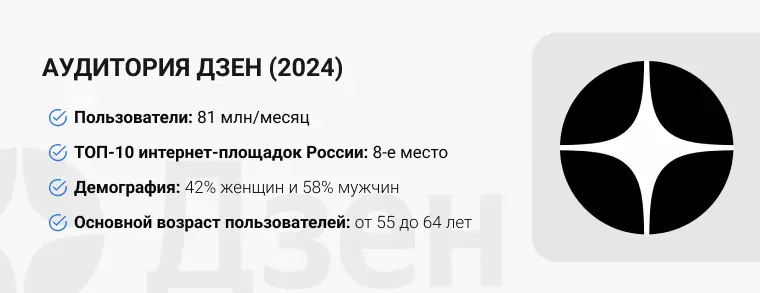
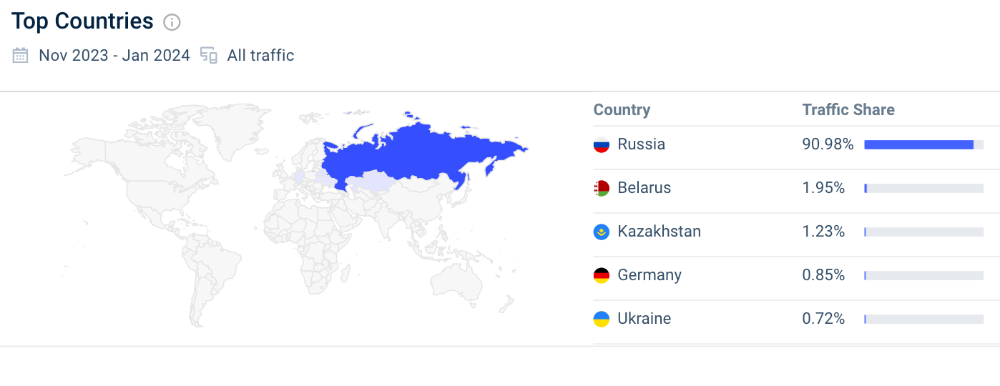
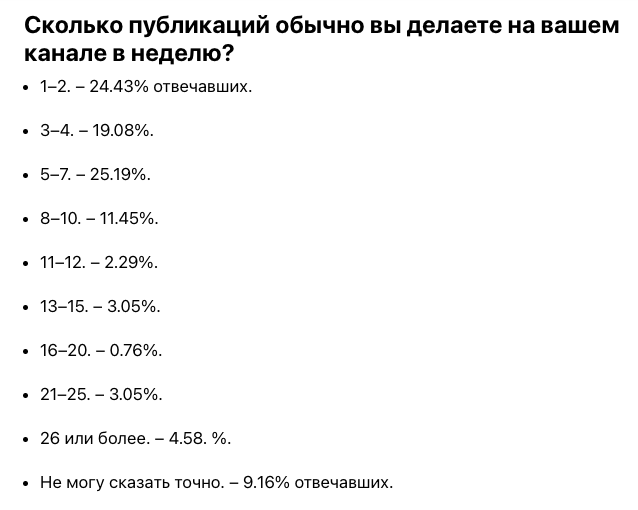
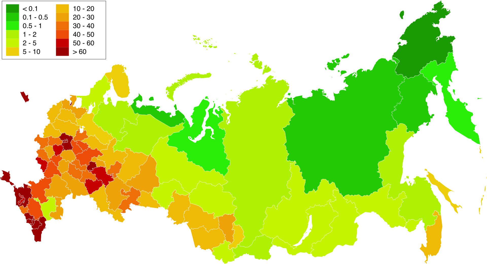

# Проектирование высоконагруженной контентной платформы
Курсовая работа в рамках 3-го семестра программы по Веб-разработке ***Образовательного центра VK x МГТУ им.Н.Э.Баумана*** (ex. "Технопарк") по дисциплине "Проектирование высоконагруженных систем"

***Автор:*** Мамадаев Муслим ([Telegram](https://t.me/muslimitsuhide), [VK](https://vk.com/muslimitsuhide))

---

#### Содержание:
1. [Тема, функционал и аудитория](#1)
2. [Расчёт нагрузки](#2)
3. [Глобальная балансировка нагрузки](#3)
4. [Список используемых источников](#4)
---

## Часть 1. Тема, функционал и аудитория

### Тема курсовой работы: ***"Проектирование контентной платформы"***
В качестве примера выбран один из ведущих в России сервисов обмена и просмотра контента - [Дзен](https://dzen.ru/)

### Ключевой функционал сервиса:
- Регистрация и авторизация пользователей;
- Создание собственного канала;
- Создание контента (собственных публикаций);
    - Возможность написать статью/пост;
    - Возможность загрузить видео;
- Оценка публикаций;
    - Возможность поставить лайк/дизлайк на публикацию;
    - Возможность написать комментарий под публикацией;
- Редактирование ранее написанных статей/постов;
- Подписка на других пользователей;
- Поиск (по названию канала/видео/статьи или поста).

### Ключевые продуктовые решения:
- **Персонализированная лента и рекомендации** публикаций и каналов для пользователей. С помощью алгоритмов анализируются интересы и предпочтения, чтобы предложить максимально релевантный контент, который будет интересен пользователю;
- Дзен собирает данные о пользователе (лайки, история чтения статей/постов, взаимодейтвие с контентом и т.д.) и в дальнейшем эти данные с помощью алгоритмов анализируются и используются для подбора **релевантных рекламных предложений** для конкретного пользователя;
- **Монетизация для партнеров:** Партнеры Дзена могут зарабатывать на своем контенте через размещение рекламы. Они получают долю от выручки, которую генерирует их контент благодаря показам и взаимодействию с рекламой. Она также подбирается на основе интересов и предпочтений пользователя и отображается в ленте.

### Целевая аудитория:
По данным ***Mediascope[^1]***, аудитория Дзена в России составляет **81 млн человек** в месяц. Дзен охватывает 67.5% населения России. 26.4% россиян используют Дзен каждый день. Это примерно 32 млн пользователей. 

- MAU: 81М
- DAU: 32М

По данным ***Similarweb[^2]***, 90.98% мирового трафика Дзена приходится на Россию. Второе место занимает Беларусь с 1.95%, третье — Казахстан с 1.23%.

## Часть 2. Расчёт нагрузки

### Продуктовые метрики:

#### MAU - 81 млн пользователей [^1]
#### DAU - 32 млн пользователей [^1]

### Средний размер харанилища пользователя по типам:

#### Основная информация: 
- Название канала может содержать максимум ***140 символов***, а описание максимум ***300 символов***. Каждый символ занимает 1 байт, тогда на хранение этих данных необходимо `440 байт`. 
- Аватарка должна быть весом не более `10МБ`. 

#### Дополнительная информация: 
Также имеется дополнительная информация, как ссылка на сайт или блог (*1 ссылка*), телефон (*максимум 3 номера*), почта (*максимум 3 адреса*) и соцсети (*максимум 5 ссылок*). 
- Для хранения URL в среднем понадобится `100 байт`, так как храниться их может максимум 6, то понадобится `600 байт` памяти. 
- **Самый длинный номер телефона[^3]** содержит 15 символов, поэтому для хранения 3 номеров нам необходимо максимум `45 байт`. 
- **Под адрес электронной почты выделим[^4]** `320 байт`, а так как их может быть 3, то понадобится `960 байт` памяти. Под дополнительную информацию необходимо 

#### Публикации
- **Посты** подразумевают собой собой как тексовый формат, так и фотографии, длина текста до 4096 тысяч символов, максимальный размер фотографии - `30МБ` и добавить максимально можно 10 фотографий, получается нужно около `4096 байт` для хранения текста и `300МБ` для хранения фотографий. Вес поста ~ `300МБ`.
- **Статьи** подразумевают собой как тексовый формат, так и фотографии, максимальный размер фотографии - `30МБ` и добавить максимально можно 10 фотографий, получается `300МБ`. Объем текста в статьях ограничен 200 символами, поэтому получаем `200 байт`. Итого максимальный вес статьи составляет около `300МБ`. В среднем в статье на Дзене встречается около 5-6 изображений, поэтому предположим, что средний вес статьи ~ `150МБ`
- **Видео**. Максимальный размер - `10.000МБ`. Предположим, что средняя продолжительность видео на Дзене - 15 минут, предположим, что оно загружено в качестве 1080p, поэтому его вес будет равен примерно ~ `300МБ`.

| Хранимые данные   | Оценочный размер на пользователя         | Источник |
|:-------------------------:|:--------------------------------:|:--------:|
| MAU                       | `82 млн`                         |[^1]|
| DAU                       | `32 млн`                         |[^1]|
| Количество публикаций, сделанных пользователем за неделю| `6`|[^5]|
| Количество создаваемых постов пользователем в месяц | `9 поста`|Предположительно|
| Количество создаваемых статей пользователем в месяц | `9 статьи`|Предположительно|
| Количество публикаций видео пользователем в месяц| `6 видео`|Предположительно|
| Количество подписок одним пользователем в месяц| `10`|Предположительно|
| Количество оценок одним пользователем в месяц| `100`|Предположительно|
| Аватар                    | `Max 10 МБ`         |Проверено вручную|
| Основная информация       | `440 байт`          |Проверено вручную|
| Дополнительная информация | `1605 байт`         |Проверено вручную|

**Итого оценочно:** ~ `10 МБ` на пользователя при полном заполнении информации о канале. 

### Среднее количество действий пользователя по типам в день:

Как видим, активный пользователь Дзен  в среднем публикует 5.8 публикаций в неделю - это 0.82 публикации в сутки и 24 публикаций в месяц. Предположим, что из 24 публикаций 9 статей, 9 постов и 6 видео.

- Создание контента: `5.8 публикаций/нед / 7 суток/нед ~ 0.82 публикаций/сутки`[^5]

- Оценка публикаций: `100 оценок/месяц / 30 суток/месяц ~ 3.3 оценок/сутки`

- Подписка на других пользователей: `10 подписок/месяц / 30 суток/месяц ~ 0.33 подписок/сутки`

- Использование поиска: `~ 1 поиск/сутки`

- Просмотр публикаций в ленте: `~ 60 публикаций/сутки`

По данным Mediascope, аудитория Дзена в России составляет 81 млн человек в месяц. Это на 15.91% больше, чем в 2022 году[^6]. Отсюда получим коэффициент прироста: `81*1.16-81/81=0.16`

### Технические метрики

### Размер хранения в разбивке по типам данных:

| Тип данных | Оценочный размер на 1 пользователя | Суммарный прирост |
|:----------:|:----------------------------------:|:---------------------------:|
| Данные пользователей      | `10 МБ`            | `129ТБ 600ГБ/месяц` |
| История поиска            | `1 КБ`          | `11.5ГБ/месяц` |
| Статьи                    | `150 МБ`          | `2ПБ/месяц` |
| Посты                     | `300 МБ`          | `4ПБ/месяц` |
| Видео                     | `300 МБ`          | `4ПБ/месяц` |

Расчёты хранилища:
- Данные пользователей: `10МБ * 81млн MAU * 0.16 (коэфициент прироста пользователей) = 129ТБ 600ГБ/месяц`
- История поиска: `1КБ * 81млн MAU * 0.16 (коэфициент прироста пользователей) = 11.5ГБ/месяц`
- Статьи: `150МБ * 81млн MAU * 0.16 (коэфициент прироста пользователей) = 2ПБ/месяц`
- Посты: `300МБ * 81млн MAU * 0.16 (коэфициент прироста пользователей) = 4ПБ/месяц`
- Видео: `300МБ * 81млн MAU * 0.16 (коэфициент прироста пользователей) = 4ПБ/месяц`

### RPS по типам запросов:

| Тип запроса   | Средний оценочный RPS          |
|:-------------------------------:|:------------:|
| Авторизация                     | `7.4`        |
| Регистрация                     | `0.49`       |
| Создание контента               | `303`         |
| Оценка публикаций               | `6148`         |
| Подписка на других пользователей| `244`         |
| Поиск                           | `370`         |
| Просмотр ленты                  | `22222`       |
| Открытие публикации             | `1851`       |

- Авторизация: `0.02 * 32млн DAU / (24 * 3600) с/сут ~ 7.4 RPS` - каждая 50-ая сессия в сервисе просит авторизации.
- Регистрация: `0.16 годовой коэф. прироста пользователей * 100млн / (365 * 24 * 3600) с/сут ~ 0.49 RPS`
- Создание контента: `0.82 публикаций/сутки/пользователь * 32млн DAU / (24 * 3600) с/сут ~ 303 RPS`
- Оценка публикаций: `16.6 оценок/сутки/пользователель * 32млн DAU / (24 * 3600) с/сут ~ 6148 RPS`
- Подписка на других пользователей: `0.66 подписок/сутки/пользователь * 32млн DAU / (24 * 3600) с/сут ~ 244 RPS`
- Поиск: `1 поиск/сутки/пользователь * 32млн DAU / (24 * 3600) с/сут ~ 370 RPS`
- Просмотр ленты: `32млн DAU * 60 / (24 * 3600) с/сут ~ 22222 RPS` при условии, что пользователь просматривает 60 публикаций в день.
- Открытие публикации: Предположим, что пользователь открывает 5 из 60 в день, тогда: `32млн DAU * 5 / (24 * 3600) с/сут ~ 1851 RPS`

Суммарный RPS по основным запросам: = `31145`

### Сетевой трафик

**Пиковое потребление в течение суток (Гбит/с) по типам трафика:**
| Тип трафика        | Пиковое потребление, Гбит/с       | Суммарный суточный трафик, Гбит/сутки  |
|--------------------|-----------------------------------|----------------------------------------|
| Cтатические файлы  | `43.5`                            | `31104`                                |
| API                | `1.08`                            | `1036800`                                |

Расчёты трафика:

**Средний:**
  - API: `31145 RPS * 1.5 КБ средний размер запроса / (1024 * 1024 / 8) КБ/Гбит = 0.36 Гбит/с`
  - Статика: `1851 RPS * 1 МБ средний размер запроса / (1024 / 8) МБ/Гбит = 14.5 Гбит/с`

**Пиковый:**

  Пиковый коэффициент трафика возьмем от среднего с запасом = 3
   - API: `3 пиковый коэф * 0.36 Гбит/с средний трафик = 1.08 Гбит/с`
   - Статика: `3 пиковый коэф * 14.5 Гбит/с средний трафик = 43.5 Гбит/с`

**Суммарный суточный:**
  - API: `0.36 Гбит/с средний трафик * (24 * 3600) с/сут = 31104 Гбит/сут`
  - Статика: `14.5 Гбит/с средний трафик * (24 * 3600) с/сут = 1252800 Гбит/сут`

## Часть 3. Глобальная балансировка нагрузки 

### Расположение ЦОДов

Для обеспечения минимального latency основную часть дата-центров следует размещать на территории, которая будет наиболее близка к месту с наибольшим количеством пользователей. 

Так как в случае Дзена 90.98% трафика приходится на российский рынок[^2], то ЦОДы размещать стоит в первую очередь в наиболее густонаселённых регионах РФ с наибольшим уровнем жизни, потому что именно там наибольшая ЦА сервиса. Посмотрим на плотность населения субъектов России:

Поэтому стоит расположить ЦОДы в **Москве** и **Санкт-Петербургом**.

Также стоит учитывать, что ЦА Дзена являются не только пользователи России, но и Казахстана, поэтому для уменьшения latency большой части пользователей РФ и Казахстана стоит расположить ЦОД около **Екатеренбурга**.

Для уменьшения latency для пользователей Беларуси, Германии и Украины стоит расположить один из ЦОДов около **Курска**.

Немало важным является то, что при выборе конкретных населённых пунктов для размещения ЦОДов стоит также обращать внимание на стоимость электроэнергии и географическую доступность - для более простой поддержки, обслуживания и проведения технических работ на серверах.

### Методы глобальной балансировки

Для глобальной балансировки запросов и нагрузки будем использовать:
- Для определения региона - latency-based DNS (Amazon Route 53), так как он совмещает себе возможность обрабатывать запросы ближайшими ЦОДами и мониторинг RTT (Round Trip Time) в сети;
- Далее в рамках своей Autonomous System будем балансировать запросы между ЦОДами с помощью Routing - BGP Anycast.

### Список используемых источников :
[^1]: [Аналитика Дзена с Mediascope](https://mediascope.net/data/)

[^2]: [Аналитика Дзена с Similarweb](https://pro.similarweb.com/#/digitalsuite/websiteanalysis/overview/website-performance/*/999/3m?webSource=Total&key=dzen.ru)

[^3]: [Самый длинный номер телефона в мире](https://fsnslnr.su/faq/kakoi-samyi-dlinnyi-nomer-telefona-v-mire)

[^4]: [Длина почтового адреса](https://habr.com/ru/articles/274985/comments/#comment_8737021)

[^5]: [Опрос о количестве публикаций](https://dzen.ru/a/YbIJWOoUI0j-rITN)

[^6]: [Стастистика Дзена](https://dzen.ru/a/ZXhr3VsOdRunHnTx)