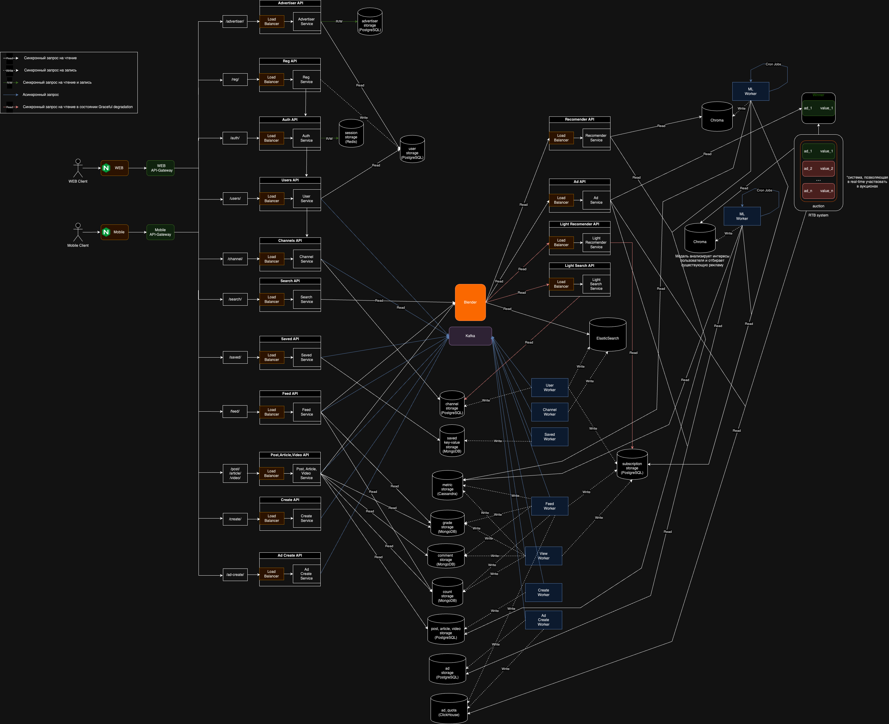

# Проектирование высоконагруженной контентной платформы
Курсовая работа в рамках 3-го семестра программы по Веб-разработке ***Образовательного центра VK x МГТУ им.Н.Э.Баумана*** (ex. "Технопарк") по дисциплине "Проектирование высоконагруженных систем"

***Автор:*** Мамадаев Муслим ([Telegram](https://t.me/muslimitsuhide), [VK](https://vk.com/muslimitsuhide))

---

#### Содержание:
1. [Тема, функционал и аудитория](#1)
2. [Расчёт нагрузки](#2)
3. [Глобальная балансировка нагрузки](#3)
4. [Локальная балансировка нагрузки](#4)
5. [Логичекая схема БД](#5)
6. [Физическая схема БД](#6)
7. [Алгоритмы](#7)
8. [Технологии](#8)
9. [Схема проекта](#9)
10. [Обеспечение надежности](#10)
11. [Выбор оборудования и хостинга](#11)
12. [Список используемых источников](#12)
---

## Часть 1. Тема, функционал и аудитория

### Тема курсовой работы: ***"Проектирование контентной платформы"***
В качестве примера выбран один из ведущих в России сервисов обмена и просмотра контента - [Дзен](https://dzen.ru/)

### Ключевой функционал сервиса:
- Регистрация и авторизация пользователей;
- Создание собственного канала;
- Создание контента (собственных публикаций);
    - Возможность написать статью/пост;
    - Возможность загрузить видео;
- Оценка публикаций;
    - Возможность поставить лайк/дизлайк на публикацию;
    - Возможность написать комментарий под публикацией;
- Редактирование ранее написанных статей/постов;
- Подписка на других пользователей;
- Поиск (по названию канала/видео/статьи или поста).

### Ключевые продуктовые решения:
- **Персонализированная лента и рекомендации** публикаций и каналов для пользователей. С помощью алгоритмов анализируются интересы и предпочтения, чтобы предложить максимально релевантный контент, который будет интересен пользователю;
- Дзен собирает данные о пользователе (лайки, история чтения статей/постов, взаимодейтвие с контентом и т.д.) и в дальнейшем эти данные с помощью алгоритмов анализируются и используются для подбора **релевантных рекламных предложений** для конкретного пользователя;
- **Монетизация для партнеров:** Партнеры Дзена могут зарабатывать на своем контенте через размещение рекламы. Они получают долю от выручки, которую генерирует их контент благодаря показам и взаимодействию с рекламой. Она также подбирается на основе интересов и предпочтений пользователя и отображается в ленте.

### Целевая аудитория:
По данным ***Mediascope[^1]***, аудитория Дзена в России составляет **81 млн человек** в месяц. Дзен охватывает 67.5% населения России. 26.4% россиян используют Дзен каждый день. Это примерно 32 млн пользователей. 

- MAU: 81М
- DAU: 32М

По данным ***Similarweb[^2]***, 90.98% мирового трафика Дзена приходится на Россию. Второе место занимает Беларусь с 1.95%, третье — Казахстан с 1.23%.

## Часть 2. Расчёт нагрузки

### Продуктовые метрики:

#### MAU - 81 млн пользователей [^1]
#### DAU - 32 млн пользователей [^1]

### Средний размер харанилища пользователя по типам:

#### Основная информация: 
- Название канала может содержать максимум ***140 символов***, а описание максимум ***300 символов***. Каждый символ занимает 1 байт, тогда на хранение этих данных необходимо `440 байт`. 
- Аватарка должна быть весом не более `10МБ`. 

#### Дополнительная информация: 
Также имеется дополнительная информация, как ссылка на сайт или блог (*1 ссылка*), телефон (*максимум 3 номера*), почта (*максимум 3 адреса*) и соцсети (*максимум 5 ссылок*). 
- Для хранения URL в среднем понадобится `100 байт`, так как храниться их может максимум 6, то понадобится `600 байт` памяти. 
- **Самый длинный номер телефона[^3]** содержит 15 символов, поэтому для хранения 3 номеров нам необходимо максимум `45 байт`. 
- **Под адрес электронной почты выделим[^4]** `320 байт`, а так как их может быть 3, то понадобится `960 байт` памяти. Под дополнительную информацию необходимо 

#### Публикации
- **Посты** подразумевают собой собой как тексовый формат, так и фотографии, длина текста до 4096 тысяч символов, максимальный размер фотографии - `30МБ` и добавить максимально можно 10 фотографий, получается нужно около `4096 байт` для хранения текста и `300МБ` для хранения фотографий. Вес поста ~ `300МБ`.
- **Статьи** подразумевают собой как тексовый формат, так и фотографии, максимальный размер фотографии - `30МБ` и добавить максимально можно 10 фотографий, получается `300МБ`. Объем текста в статьях ограничен 200 символами, поэтому получаем `200 байт`. Итого максимальный вес статьи составляет около `300МБ`. В среднем в статье на Дзене встречается около 5-6 изображений, поэтому предположим, что средний вес статьи ~ `150МБ`
- **Видео**. Максимальный размер - `10.000МБ`. Предположим, что средняя продолжительность видео на Дзене - 15 минут, предположим, что оно загружено в качестве 1080p, поэтому его вес будет равен примерно ~ `300МБ`.

| Хранимые данные   | Оценочный размер на пользователя         | Источник |
|:-------------------------:|:--------------------------------:|:--------:|
| MAU                       | `82 млн`                         |[^1]|
| DAU                       | `32 млн`                         |[^1]|
| Количество публикаций, сделанных пользователем за неделю| `6`|[^5]|
| Количество создаваемых постов пользователем в месяц | `9 поста`|Предположительно|
| Количество создаваемых статей пользователем в месяц | `9 статьи`|Предположительно|
| Количество публикаций видео пользователем в месяц| `6 видео`|Предположительно|
| Количество подписок одним пользователем в месяц| `10`|Предположительно|
| Количество оценок одним пользователем в месяц| `100`|Предположительно|
| Аватар                    | `Max 10 МБ`         |Проверено вручную|
| Основная информация       | `440 байт`          |Проверено вручную|
| Дополнительная информация | `1605 байт`         |Проверено вручную|

**Итого оценочно:** ~ `10 МБ` на пользователя при полном заполнении информации о канале. 

### Среднее количество действий пользователя по типам в день:

Как видим, активный пользователь Дзен  в среднем публикует 5.8 публикаций в неделю - это 0.82 публикации в сутки и 24 публикаций в месяц. Предположим, что из 24 публикаций 9 статей, 9 постов и 6 видео.

- Создание контента: `5.8 публикаций/нед / 7 суток/нед ~ 0.82 публикаций/сутки`[^5]

- Оценка публикаций: `100 оценок/месяц / 30 суток/месяц ~ 3.3 оценок/сутки`

- Написание комментария: `20 комментариев/месяц / 30 суток/меясц ~ 0.7 комментария/сутки`

- Подписка на других пользователей: `10 подписок/месяц / 30 суток/месяц ~ 0.33 подписок/сутки`

- Использование поиска: `~ 4 поиск/сутки`

- Просмотр публикаций в ленте: `~ 100 публикаций/сутки`

По данным Mediascope, аудитория Дзена в России составляет 81 млн человек в месяц. Это на 15.91% больше, чем в 2022 году[^6]. Отсюда получим коэффициент прироста: `81*1.16-81/81=0.16`

### Технические метрики

### Размер хранения в разбивке по типам данных:

| Тип данных | Оценочный размер на 1 пользователя | Суммарный прирост |
|:----------:|:----------------------------------:|:---------------------------:|
| Данные пользователей      | `10 МБ`            | `129ТБ 600ГБ/месяц` |
| История поиска            | `1 КБ`          | `11.5ГБ/месяц` |
| Статьи                    | `150 МБ`          | `2ПБ/месяц` |
| Посты                     | `300 МБ`          | `4ПБ/месяц` |
| Видео                     | `300 МБ`          | `4ПБ/месяц` |

Расчёты хранилища:
- Данные пользователей: `10МБ * 81млн MAU * 0.16 (коэфициент прироста пользователей) = 129ТБ 600ГБ/месяц`
- История поиска: `1КБ * 81млн MAU * 0.16 (коэфициент прироста пользователей) = 11.5ГБ/месяц`
- Статьи: `150МБ * 81млн MAU * 0.16 (коэфициент прироста пользователей) = 2ПБ/месяц`
- Посты: `300МБ * 81млн MAU * 0.16 (коэфициент прироста пользователей) = 4ПБ/месяц`
- Видео: `300МБ * 81млн MAU * 0.16 (коэфициент прироста пользователей) = 4ПБ/месяц`

### RPS по типам запросов:

| Тип запроса   | Средний оценочный RPS          |
|:-------------------------------:|:------------:|
| Авторизация                     | `7.4`        |
| Регистрация                     | `0.49`       |
| Создание контента               | `303`         |
| Оценка публикаций               | `6148`         |
| Написание комментария           |`260`|
| Подписка на других пользователей| `244`         |
| Поиск                           | `1481`         |
| Просмотр ленты                  | `37 037`       |
| Открытие публикации             | `11 112`       |
| Открытие канала                 | `1852`        |

- Авторизация: `0.02 * 32млн DAU / (24 * 3600) с/сут ~ 7.4 RPS` - каждая 50-ая сессия в сервисе просит авторизации.
- Регистрация: `0.16 годовой коэф. прироста пользователей * 100млн / (365 * 24 * 3600) с/сут ~ 0.49 RPS`
- Создание контента: `0.82 публикаций/сутки/пользователь * 32млн DAU / (24 * 3600) с/сут ~ 303 RPS`
- Оценка публикаций: `16.6 оценок/сутки/пользователель * 32млн DAU / (24 * 3600) с/сут ~ 6148 RPS`
- Написание комментария: `0.7 комментария/сутки/пользователь * 32млн DAU / (24 * 3600) с/сут ~ 260 RPS`
- Подписка на других пользователей: `0.66 подписок/сутки/пользователь * 32млн DAU / (24 * 3600) с/сут ~ 244 RPS`
- Поиск: `4 поиск/сутки/пользователь * 32млн DAU / (24 * 3600) с/сут ~ 1481 RPS`
- Просмотр ленты: `32млн DAU * 100 / (24 * 3600) с/сут ~ 37 037 RPS` при условии, что пользователь просматривает 100 публикаций в день.
- Открытие публикации: Предположим, что пользователь открывает 30 из 100 в день, тогда: `32млн DAU * 30 / (24 * 3600) с/сут ~ 11 112 RPS`
- Открытие канала: Предположим, что пользователь открывает 5 каналов в день, тогда: `32млн DAU * 5 / (24 * 3600) с/сут ~ 1852 RPS`

Суммарный RPS по основным запросам: `58444`

Причем пиковый RPS будет равен `3 * 58444 = 175 332`
### Сетевой трафик

**Пиковое потребление в течение суток (Гбит/с) по типам трафика:**
| Тип трафика        | Пиковое потребление, Гбит/с       | Суммарный суточный трафик, Гбит/сутки  |
|--------------------|-----------------------------------|----------------------------------------|
| Cтатические файлы  | `43.5`                            | `31104`                                |
| API                | `1.08`                            | `1036800`                                |

Расчёты трафика:

**Средний:**
  - API: `31145 RPS * 1.5 КБ средний размер запроса / (1024 * 1024 / 8) КБ/Гбит = 0.36 Гбит/с`
  - Статика: `1851 RPS * 1 МБ средний размер запроса / (1024 / 8) МБ/Гбит = 14.5 Гбит/с`

**Пиковый:**

  Пиковый коэффициент трафика возьмем от среднего с запасом = 3
   - API: `3 пиковый коэф * 0.36 Гбит/с средний трафик = 1.08 Гбит/с`
   - Статика: `3 пиковый коэф * 14.5 Гбит/с средний трафик = 43.5 Гбит/с`

**Суммарный суточный:**
  - API: `0.36 Гбит/с средний трафик * (24 * 3600) с/сут = 31104 Гбит/сут`
  - Статика: `14.5 Гбит/с средний трафик * (24 * 3600) с/сут = 1252800 Гбит/сут`

## Часть 3. Глобальная балансировка нагрузки 

### Расположение ЦОДов

Для обеспечения минимального latency основную часть дата-центров следует размещать на территории, которая будет наиболее близка к месту с наибольшим количеством пользователей. 

Так как в случае Дзена 90.98% трафика приходится на российский рынок[^2], то ЦОДы размещать стоит в первую очередь в наиболее густонаселённых регионах РФ с наибольшим уровнем жизни, потому что именно там наибольшая ЦА сервиса. Посмотрим на плотность населения субъектов России:

Поэтому стоит расположить ЦОДы в **Москве** и **Санкт-Петербургом**.

Также стоит учитывать, что ЦА Дзена являются не только пользователи России, поэтому для уменьшения latency для пользователей Беларуси, Германии и Украины стоит расположить один из ЦОДов около **Курска**.

Немало важным является то, что при выборе конкретных населённых пунктов для размещения ЦОДов стоит также обращать внимание на стоимость электроэнергии и географическую доступность - для более простой поддержки, обслуживания и проведения технических работ на серверах.

### Методы глобальной балансировки

Для глобальной балансировки запросов и нагрузки будем использовать:
- Для определения региона - latency-based DNS (Amazon Route 53), так как он совмещает себе возможность обрабатывать запросы ближайшими ЦОДами и мониторинг RTT (Round Trip Time) в сети;
- Будем балансировать запросы между ЦОДами с помощью Routing - BGP Anycast.

## Часть 4. Локальная балансировка нагрузки 

### Схема балансировки

- **BGP Anycast**: Так используется роутинг с помощью BGP Anycast, балансировка на L4 может быть полезна в минимальном количестве сценариев.

- **L7-балансировщик Nginx**: Внутри ЦОДов можно использовать Nginx для балансировки нагрузки на уровне приложения. 
  - Мы можем использовать различные алгоритмы балансировки, такие как Round-Robin c циклическим списком и Least Connection, для равномерного распределения запросов и обеспечения отказоустойчивости. 
  - Реализация API-Gateway. Основные функции, которые нам понадобятся: маршрутизация запросов, опеределение прав доступа, также возможна авторизация, логирование и мониторинг (API-Gateway может регистрировать все входящие и исходящие запросы, а также собирать статистику о производительности и использовании API)
  - Терминализация SSL
  - Отдача статики
  - Кэширование запросов
  - Сжатие контента с помощью gzip

- **Auto-scaling с помощью Kubernetes**: Для управления масштабированием и оркестрации сервисов внутри ЦОДов можно использовать Kubernetes. Это позволит автоматически масштабировать сервисы в зависимости от нагрузки и обеспечить высокую доступность.

### Схема отказоустойчивости

Nginx вместе с Kubernetes могут обеспечить высокую отказоустойчивость нашего сервиса с помощью автоматического восстановления после сбоев и аварий, а также перезапуск сервисов без простоев и потери доступности для пользователей.

Также для увеличения отказоустойчивости будем использовать:
  - Постоянный сбор метрик с машин и отслеживание их состояний
  - Алерты помогут оповещать о критических ситуациях, таких как сбои в работе сервиса или проблемы с производительностью.
  - График дежурства сотрудников и тщательное планирование реагирования на критические ситуации

## Часть 5. Логическая схема БД 

ссылка: https://dbdiagram.io/d/TP_24-660a7a8a37b7e33fd7324381

### Описание сущностей

|        Сущность        |           Описание            | 
|:----------------------:|:-----------------------------:|
|        session         |Данные сессий пользователей|
|         user           |Данные пользователя, которые заполняются при регистрации и дальнейшего заполнения профиля|
|         advertiser           |Данные рекламодателя, которые заполняются при регистрации и дальнейшего заполнения профиля (в total_budget хранится общий бюджет пользователя)|
|         channel        |Данные канала, которые заполняются при создании и приобретаемые после (количество подписчиков, которое хранится в **subscribers_count**)|
|         ad        |Данные рекламы, которые заполняются при создании (в target_action хранится взаимодействие, за которое берется плата, это может быть либо просмотр, либо клик; в budget хранится сумма, выделенная на эту рекламу)|
|      ad_quota        |Данные квоты рекламы (сама квота и количество кликов/просмотров)|
|       subscription       |Данные о подписчиках канала|
|          post            |Данные о посте, заполняемые при его создании и приобретаемые после публикации (такие как количество лайков, просмотров и комментариев, хранимые в **likes_count**, **views_count**, **comments_count** соответсвенно)|
|       article            |Данные о статье, заполняемые при его создании и приобретаемые после публикации (такие как количество лайков, просмотров и комментариев, хранимые в **likes_count**, **views_count**, **comments_count** соответсвенно)|
|         video            |Данные о видео, заполняемые при его создании и приобретаемые после публикации (такие как количество лайков, просмотров и комментариев, хранимые в **likes_count**, **views_count**, **comments_count** соответсвенно)|
|        moderation        |Данные о прохождении модерации|
|        ad_moderation        |Данные о прохождении модерации|
|           saved          |Данные о сохраненных публикациях|
|      search_history      |Данные о поисковых запросах пользователей (запросы хранятся в виде массива, в который попадают в зависимости от выбранного параметра поиска)|
|         counting         |Данные о числовых значениях таких величин как просмотры, лайки и комментарии|
|   subscription_count     |Данные о числовых значениях количества подписчиков|
|    post_action_metric    |Данные о взаимодействии пользователей с постами (лайки/просмотры). Поле **action** содержит тип взаимодействия: view/like, а поле **action_posts_id** содержит массив id постов, с которыми происходило взаимодействие|
|  article_action_metric   |Данные о взаимодействии пользователей со статьями, по такому же принципу, что и взаимодействие с постами(описано выше)|
|   video_action_metric    |Данные о взаимодействии пользователей с видео, по такому же принципу, что и взаимодействие с постами(описано выше)|
|   ad_action_metric    |Данные о взаимодействии пользователей c рекламой|
|    post_comment_metric   |Данные о написанных пользователями комментариях под постами|
|  article_comment_metric  |Данные о написанных пользователями комментариях под статьями|
|   video_comment_metric   |Данные о написанных пользователями комментариях под видео|
|post_finish_reading_metric|Данные о состоянии прочтения поста(высчитывается в процентах) пользователем|
|article_finish_reading_metric|Данные о состоянии прочтения статьи(высчитывается в процентах) пользователем|
|   post_grade  |Данные о лайках/дизлайках на посты|
|   post_comment  |Данные о комментариях(также возможны ответы на комментарии) под постами|
|   article_grade  |Данные о лайках/дизлайках на статьи|
|   article_comment  |Данные о комментариях(также возможны ответы на комментарии) под статьями|
|   video_grade  |Данные о лайках/дизлайках на видео|
|   video_comment  |Данные о комментариях(также возможны ответы на комментарии) под видео|

## Часть 6. Физическая схема БД 

### Выбор хранилища данных

|   |        Таблица         |           Хранилище            |      Обоснование выбора |
|:-:|:----------------------:|:------------------------------:|:-----------------------:|
|1|        session         |Redis|Хорошо подходит для хранения сеансов из-за своей высокой производительности и возможности установки TTL для ключей. Это позволяет эффективно управлять временем жизни сеансов и обеспечивать быстрый доступ к данным.|
|2|         user, channel, advertiser, subscription, post, article, video, ad, moderation, ad_moderation |PostgreSQL|PostgreSQL предлагает полную поддержку ACID-транзакций и мощные возможности индексации, что делает его хорошим выбором для наших целей (хранение данных модерации, пользователей, каналов и публикаций). Также PostgreSQL хорошо масштабируется и поддерживает сложные запросы.|
|3|        saved, counting, subscription_count |MongoDB|Лучшее решение для хранения key-value, за счет возможности хранить данные в виде JSON-подобных документов.|
|4|      search_history      |ElasticSearch|ElasticSearch специализируется на выполнении сложных поисковых запросов и анализе текстовых данных. Для хранения и обработки истории поиска, где важны текстовые запросы и их аналитика, ElasticSearch является лучшим выбором.|
|5|post_finish_reading_metric, article_finish_reading_metric, post_action_metric, article_action_metric, video_action_metric, post_comment_metric, article_comment_metric, video_comment_metric, ad_action_metric|Cassandra|Обладает высокой масштабируемостью и может легко обрабатывать большие объемы данных на нескольких узлах.|
|6|   post_grade, post_comment, article_grade, article_comment, video_grade, video_comment, ad_quota|MongoDB|MongoDB удобно использовать для хранения коллекций данных с переменной структурой, таких как оценки пользователей, где каждая запись может содержать разное количество идентификаторов объектов и оценок.|

СУБД Chroma будем использовать для хранения эмбеддингов для рекомендаций и рекламы.

### Индексы

Для более быстрого доступа к данным будем использовать индексы:

- Для таблиц user, advertiser, channel, ad, subscription, post, article, video, moderation, ad_moderation - id;

- Также для работы сервиса light search нужно добавить индекс для поля title таблицы channel;

- Для таблиц post_finish_reading_metric, post_action_metric, post_comment_metric,  post_grade, post_comment - по полю post_id;

- Для таблиц video_action_metric, video_comment_metric, video_grade, video_comment - по полю video_id;

- Для таблицы ad_action_metric - по полю ad_id;

- Для таблиц article_finish_reading_metric, article_action_metric, article_comment_metric article_comment, article_grade - по полю article_id;

- Таблицы, которые хранятся в MongoDB в виде key-value не нуждается в индексах.

### Шардинг 

- Для таблиц post_finish_reading_metric, post_action_metric, post_comment_metric,  post_grade, post_comment, video_action_metric, video_comment_metric, video_grade, video_comment, article_finish_reading_metric, article_action_metric, article_comment_metric article_comment, article_grade применим шардирвоние по **user_id**.

- Таблица user содержит очень много записей, поэтому ее лучше тоже шардировать по индификатору пользователей **user_id**. Разделим наших пользователей на несколько групп и будем хранить их на разных узлах. Распределять по шардам будем с помощью остатка от деления на количество шардов (возьмем, например, 16 шардов).

- Таблицы post, article, video содержат посты, статьи и видео, созданные пользователями. Шардинг можно применить здесь так же по полю, связанному с пользователем **channel_id**.

- Таблицы **post_comment, article_comment, video_comment, post_grade, article_grade, video_grade** содержат информацию о взаимодействиях пользователей с контентом. Можно применить шардинг по идентификатору сущности, к которой относится взаимодействие (**post_id, article_id, video_id**). Каждый шард будет содержать данные только для определенного диапазона идентификаторов, что позволит более равномерно распределить нагрузку между узлами.

## Часть 7. Алгоритмы 

### 1. Рекомендации[^7]

У каждого пользователя есть некая положительная история взаимодействия, которая называется позитивами (это лайки на какие-то публикации, долгие просмотры, дочитки постов/статей до конца и т.д.)

Имея список истории пользователя, мы можем определять, насколько релевантен контент, который мы хотим предложить ему.

Взглянем на архитектуру рекомендаций, представленную выше. На вход мы получаем пользователя с большой историей позитивов, нам нужно взять оттуда максимально сильные и в то же время разные, для этого используем алгоритм **DPP** *Determinantal Point
Processes* (вероятностная модель, которая используется для выбора подмножества объектов (позитивов в нашем случае) из некторого набора данных, учитывая взаимодействия между объектами внутри подмножества).

Далее наши 500 отобранных позитивов отправляются в сервис **item2item**, где мы ходим нашими позитивами за уже заранее подсчитанными списками кандидатов на рекомендацию. Сам сервис может быть представлен в виде БД (key-value). 

Потом все кандидаты ранжируются и получаются рекомендации к каждому позитиву, все это перемешивается и отдается пользователю в ленту.

### 2. Поиск

Для эффективного поиска в Дзене будем использовать ElasticSearch, так как мощный поисковый движок, который поможет нам обеспечить высокую скорость и точность поиска.

Поиск может быть сделан по всему, по каналам, по видео и роликам, либо по статьям и постам.

При вводе запроса с ошибкой ElasticSearch с помощью алгоритма Levenshtein distance все равно может найти то, что было необходимо пользователю, найдя наиболее похожее слово/связку слов к введенному пользователем запросу.

### Немного про расстояние Левенштейна (Levenshtein distance)[^8]

Это метрика сходства между двумя строковыми последовательностями. Чем больше расстояние, тем более различны строки. Например: `LEV(’КЛЮЧ’, ‘КЛАЧ’) = 1`, так как различен всего один символ в наших символьных строках.

Для вычисления расстояния между двумя строками используется метод Вагнера — Фишера: составляется матрица D, где каждый её элемент вычисляется по рекуррентной формуле:

здесь `S1[i]` и `S2[j]` это символы соответсвующие ячейкам i и j. Оператор `m(...)` будет равен 1, если элменты **не равны** друг другу и 0, если **равны.** 

Разберем на примере с двумя словами: `ЛАБРАДОР` и `ГИБРАЛТАР`:

Рассчитаем `D(1,1)`, это символы ‘Г’ и ‘Л’. Они не равны друг другу, значит `m(’Г’, ‘Л’) = 1`. 
Тогда D(1,1) — это минимум между значениями `D(0,1) + 1`, `D(1,0) + 1` и `D(0, 0) + m(’Г’, ‘Л’) = D(0, 0) + 1`. 
Эти клетки выделены голубым. То есть `min(1+1, 1+1, 0+1) = min(2, 2, 1) = 1`.

Рассчитаем следующую клетку, D(1, 2):

D(1, 2) = min(`D(0,2) + 1; D(1,1) + 1; D(0, 1) + 1`) = min(`2+1; 1+1; 1+1`) = 2.

Передвигая голубой уголок, аналогично заполним первые две строки и начало третьей, пока не доберёмся до совпадающих символов ‘Б’ в D(3,3):

Из-за того, что символы совпадают, замена этим двум символам не нужна, поэтому при подсчёте минимума число в розовой ячейке не увеличивается на единицу, т.е. D(3, 3) = min(`D(2,3) + 1; D(3,2) + 1; D(2, 2) + 0`) = min(`3+1; 3+1; 2+0`) = 2.

Заполняем таким образом таблицу до самого конца.
Расстояние Левенштейна в этой мартице — нижняя правая ячейка, D(9,8):

Также для реализации подсказок при вводе поискового запроса будем использовать функционал автодополнения autocomplete ElasticSearch, чтобы пользователь мог получать предложения по поисковому запросу по мере его написания.

### Немного про autocomplete ElasticSearch[^9]

Когда мы начинаем вводить текст в поле поиска, мы получаем выпадающий список с предложениями продления символьной строки, что мы уже успели написать:

Стоит учитывать, что главное условие в работе автопродления - это скорость, если список из подсказок не успевает выпасть до того момента, пока пользователь не закончил печатать, то смысл такого автопродления просто пропадает.

Именно поэтому в Elasticsearch используется структура данных FST, которая выглядит следующим образом:

Рассмотрим этот пример

- Если пользователь вводит букву `h`, то мы сразу же можем дополнить это слово до `hotel`, так как в нашем датасете (*в нашем проекте датасетом является история поиска всех пользователей*) не существует больше других слов/сочетаний слов, начинающихся с буквы `h`.

- Если же пользователь вводит букву `m`, то уже в данном случае отображаются три слова для автодополнения: `marriot`, `mercure`, `munchen`, `munich`. Если же далее пользователь введет букву `a` или `e`, то сразу можно будет дополнить до конечного слова, то если же введет `u`, то уже будет предложено два слова для автопродления(см. изображение выше).

### 3. Реклама[^10]

Также как и с рекомендациями у пользователя есть некая положительная история взаимодействия, которая называется позитивами (это лайки на какие-то публикации, долгие просмотры, дочитки постов/статей до конца и т.д.), но также в данном случае учитывается и поисковые запросы. Из всего массива позитивов, нам нужно взять максимально сильные и в то же время разные, для этого используем алгоритм **DPP** *Determinantal Point
Processes* (вероятностная модель, которая используется для выбора подмножества объектов (позитивов в нашем случае) из некторого набора данных, учитывая взаимодействия между объектами внутри подмножества). Для выделения ключевых слов из публикаций, с которыми взаимодействовал пользователь, применяется алгоритм обработки естественного языка **(Natural Language Processing, NLP)**. Грубо говоря, на входе у нас есть большая статья, нам нужно получить краткую выжимку с ключевыми словами этой статьи. Получаем, что у нас есть пользователь с некой историей взаимодействия с контентом и массивом ключевых слов контента, с которым он взаимодействовал.

Предположим, что рекламодатель уже авторизировался в Дзене через VK Рекламу и уже создал рекламную кампанию. Он указал **сайт** (как пример), на который будете происходит переход, заголовок, текст, ключевые слова, на которые хочет таргетироваться и ставку, которая может быть списана с его счета, если произойдет клик по саму рекламному банеру (либо же просто показ, это определяется самим рекламодателем).

Рекламодатель создал рекламную кампанию, указав сайт, где продает бетон(как пример), ключевое слово: *бетон*, заголовок, описание, фотографию и указал ставку в 100₽ за клик по его банеру. Все факторы вместе со статистикой (если этот банер уже крутился) подаются на вход **MatrixNet** (модель на вход которой мы подаем набор факторов, а на выходе получаем число, в данном случае, это обобщенное качество нашего баннера). 

Имея на руках численное качество и ставку, мы вводим некую функцию Value, которая зависит от этих параметров и будет вычислять значение, с помощью которого мы сможем ранжировать эти баннера.

Далее происходит аукцион (процесс выбора победителей, исходя из значения Value)

У нас есть только 3 ячейки под рекламные баннеры, а рекламных предложения 4. Мы подаем все 4 баннера в аукцион и на выходе получаем, что первый баннер мы покажем (и в случае клика спишем 100$), второй тоже покажем и спишем 800₽ в случае клика, третий показывать не будем и четвертый покажем и спишем 100₽. Выборка баннеров произошла по значению Value. И вот пользователь получил в своей ленте 3 рекламных баннера, которые больше всего ему подходят.

## Часть 8. Технологии 

| Технология  |    Применение   |              Обоснование            |
|:-----------:|-----------------|-------------------------------------|
|TypeScript   |Frontend         |TypeScript обеспечивает статическую типизацию, что уменьшает количество ошибок на этапе разработки и улучшает уровень поддерживаемости кода.
|React        |Frontend         |Мощная библиотека для создания пользовательских интерфейсов, которая обеспечивает эффективное управление состоянием приложения и компонентной структурой.|
|Sass         |Frontend, IU     |Обеспечивает удобство и гибкость при написании CSS.|
|Go           |Backend          |Высокая производительность, богатая асинхронность, низкий порог входа, большое количество технологий из коробки, высокая утилизация CPU.|
|gRPC|Взаимодействие микросервисов|Представляет собой мощный инструмент для создания распределенных систем, обеспечивающий эффективную передачу данных и вызов удаленных процедур с использованием современных технологий и принципов разработки.|              
|PostgreSQL   |Основная БД сервиса|Одно из лучших решений для хранения данных CRUD-сервиса.|
|Redis        |Хранилище для данных сессий|Обеспечивает практически моментальный доступ к данным, поскольку хранит их в оперативной памяти.|
|Kotlin       |Mobile, Andriod |Мультиплатформенность, большое количество технологий, низкий порог входа.|
|Swift        |Mobile, IOS     |Большое количество технологий, низкий порог входа.|
|Nginx        |Балансировка нагрузки на уровне приложения|Обеспечивает распределение трафика между серверами приложений на уровне HTTP/HTTPS, что позволяет эффективно управлять нагрузкой и обеспечить отказоустойчивость.|
|API-Gateway  |Маршрутизация, авторизация, логирование, мониторинг|Выполняет роль центральной точки входа для внешних запросов к микросервисной архитектуре, обеспечивая безопасность, мониторинг и управление трафиком.|
|Kubernetes   |Масштабирование и оркестрация сервисов|Kubernetes автоматически масштабирует и управляет контейнерами с приложениями в зависимости от нагрузки, обеспечивая высокую доступность и эффективное использование ресурсов.|
|ElasticSearch|Поиск|Мощный поисковый движок, обеспечивает быстрый и гибкий поиск по структурированным и неструктурированным данным, что важно для функционала поиска в Дзене.|
|GitHub       |CI/CD, Система контроля версий, монорепозиторий, командная разработка|Удобное сопровождение всех циклов разработки и обеспечения качества проекта.|

## Часть 9. Схема проекта 

Ссылка: https://drive.google.com/file/d/1xUfbUibMueCx4gF0tEhpzwiPKRqnL2CL/view?usp=sharing

- На схеме можно заметить **Blender**, он служит для "смешивания" рекомендаций и рекламы для ленты пользователя;

- **RTB (Real Time Bidding)** система позволяет проводить аукционы рекламных показов в реальном времени;

- **ML Worker** в рекомендациях служит для анализа интересов пользователя для отбора подходящего для него контента;

- **ML Worker** в рекламе служит для анализа интересов пользователя для отбора подходящей для него рекламы.

## Часть 10. Обеспечение надежности 

### Резервирование:

- Резервирование CPU, RAM и дисков;
- Резервирование серверов;
- Резервирования ДЦ;
- Репликация БД

### Failover policy

- Уменьшение посылаемых запросов на проблемный хост, который в данный момент может не выдерживать запросы;
- Circuit Breaker. Используется для предотвращения перегрузки микросервисов, ставится перед микросервисами и следит за поведением запросов.

### Graceful shutdown

Представляет собой плавную остановку при сбоях.

Например, если наша система нуждается в каком-то техническом обслуживании/обновлении, то с помощью Graceful shutdown постепенно прекращается прием новых запросов и завершается обработка текущих запросов, корректно закрывая все соединения.

### Graceful degradation

Основной функционал продолжит работать даже при выходе из строя значительной части системы.

#### Примеры: 

- Отказ компонента рекомендательной системы: 
  
  Если сервис, отвечающий за рекомендации (Recomender) контента пользователям перестает работать, то приложение переходит в состояние Graceful degradation и начинает использоваться упрощенный метод показа ленты: идем в сервис Light Recomender, который достает нам публикации по упрощенной логике (достает последние публикации каналов, на которые подписан пользователь).

- Отказ Elasticsearch:

  При отказе Elasticsearch приложение переходит в состояние Graceful degradation и начинает использоваться упрощенный метод поиска: идем в сервис Light Search, который делает поиск по полю title в БД channel.

- Отказ счетчиков:

  При отказе БД с счетчиками приложение опять переходит в состояние Graceful degradation и перестает показывать количество лайков, просмотров и тд пользователю. 

### Human resources:

- SRE-инженеры;
- Жесткая политика код-ревью;
- Команда DevOps.

## Часть 11. Выбор оборудования и хостинга 

### Сервера

Дзен имеет на своем пике 175 332 RPS и 44.5 Гбит/сек сетевого трафика (данные берем из раздела [Расчёт нагрузки](#2))

Учитывая данные с сайта nginx:

Видим, что сервер с 16 CPU будет успешно выдерживает 77 427 RPS, таким образом:

`175 332/77 427 ~ 2.3` Округляем в большую сторону и получаем 3 сервера.

Полученная конфигурация nginx:

|CPU|Net|Count|
|:------:|:-----------:|:---:|
|16  |    48 Гбит/сек    |3|

Таблица необходимых ресурсов для всех сервисов проекта:

|Сервис|Описание|Пиковый RPS|CPU|RAM|
|:-----:|:----:|:--------:|:---:|:-:|
|Auth  |авторизация|    7.4    |1|1 Мб|
|Reg   |регистрация|    0.49    |1|1 Мб|
|Create|создание контента|    303  |4|512 Мб|
|Grade |оценка публикаций|  6148   |62|7 Гб|
|Comment|написание комментария|260|3|512 Мб|
|Subscribe|подписка на пользователей|244|3|512 Мб|
|Search|поиск|1481|15|2 Гб|
|Feed|просмотр ленты|37 037|371|38 Гб|
|Post, Article, Video|открытие публикации из ленты|11 112|112|12 Гб|
|Channel|открытие канала|1852|19|2 Гб|

- 1 ядро CPU на 100 запросов 
- 1 Гб RAM на 1000 запросов

|Сервис|Хостинг|Конфигурация|Количество|Покупка (1 шт.)|Аренда (1 шт/мес)|
|:-----:|:----:|:--------:|:-:|:-:|:-:|
|Auth|own|4 core CPU; 1x8 GB RAM 2400 MHz DDR4 (CyberServe EPYC EP1-102)|3|€1 710.45|€30|
|Reg|own|4 core CPU; 1x8 GB RAM 2400 MHz DDR4 (CyberServe EPYC EP1-102)|3|€1 710.45|€30|
|Create|own|16 core CPU; 4x8 GB RAM 2400 MHz DDR4 (CyberServe Xeon SP1-P04S G4)|3|€6 019.68|€120|
|Grade |own|16 core CPU; 4x8 GB RAM 2400 MHz DDR4 (CyberServe Xeon SP1-P04S G4)|3|€6 019.68|€120|
|Comment|own|16 core CPU; 4x8 GB RAM 2400 MHz DDR4 (CyberServe Xeon SP1-P04S G4)|3|€6 019.68|€120|
|Subscribe|own|16 core CPU; 4x8 GB RAM 2400 MHz DDR4 (CyberServe Xeon SP1-P04S G4)|3|€6 019.68|€120|
|Search|own|8 core CPU; 1x8 GB RAM 2400 MHz DDR4 (CyberServe EPYC EP1-102)|3|€1 677.53|€40|
|Feed|own|16 core CPU; 4x8 GB RAM 2400 MHz DDR4 (CyberServe Xeon SP1-P04S G4)|9|€6 019.68|€120|
|Post, Article, Video|own|16 core CPU; 4x8 GB RAM 2400 MHz DDR4 (CyberServe Xeon SP1-P04S G4)|6|€6 019.68|€120|
|Channel|own|8 core CPU; 1x8 GB RAM 2400 MHz DDR4 (CyberServe EPYC EP1-102)|3|€1 710.45|€40|
|ElasticSearch|own|16 core CPU; 4x8 GB RAM 2400 MHz DDR4 (CyberServe Xeon SP1-P04S G4)|3|€6 019.68|€120|
|Cassandra|own|16 core CPU; 4x8 GB RAM 2400 MHz DDR4 (CyberServe Xeon SP1-P04S G4)|3|€6 019.68|€120|
|PostgreSQL|own|16 core CPU; 4x8 GB RAM 2400 MHz DDR4 (CyberServe Xeon SP1-P04S G4)|3|€6 019.68|€120|
|MongoDB|own|16 core CPU; 4x8 GB RAM 2400 MHz DDR4 (CyberServe Xeon SP1-P04S G4)|3|€6 019.68|€120|
|Redis|own|16 core CPU; 4x8 GB RAM 2400 MHz DDR4 (CyberServe Xeon SP1-P04S G4)|3|€6 019.68|€120|
|Nginx|own|16 core CPU; 4x8 GB RAM 2400 MHz DDR4 (CyberServe Xeon SP1-P04S G4)|3|€6 019.68|€120|

Рассчитаем амортизацию на ближайшие 5 лет (60 месяцев):

Если будем арендовать оборудование, то получим следующую сумму:

`3*30*60 + 3*30*60 + 3*120*60 + 3*120*60 + 3*120*60 + 3*120*60 + 3*40*60 + 9*120*60 + 6*120*60 + 3*40*60 + 3*120*60 + 3*120*60 + 3*120*60 + 3*120*60 + 3*120*60 + 3*120*60 = €349 200`

### Итоги

Рассчитаем цену всего оборудования, если покупать его:

`6 019.68 * 42 + 1 710.45 * 12 + 1 677.53 * 3 = €296 444`

Нужно учитывать, что для поддержания работоспособности оборудования необходимо помещение и специальные условия внутри помещения, также будет необходим персонал, который будет за всем этим следить. Предположим, что все это будет обходиться нам в `€4 000` в месяц, тогда если рассчитывать амортизацию на 5 лет, выйдет `€240 000` плюсом к тому, что мы рассчитали выше. 

Таким образом, получаем следующие цифры: если закупать оборудование на расчетом на 5 лет, то вместе с поддержкой оно обойдется нам в `€536 444`, а если арендовать то же самое оборудование, то выйдет `€349 200`. Получается, если рассматривать период использования - 5 лет, то выгоднее будет арендовать оборудование, нежели покупать собственное.

Но если рассмотреть более долгосрочную амортизацию, то ситуация будет следующая:

Оборудование, в среднем, меняется раз в 10 лет, поэтому цирфы будут следующие для амортизации на 10 лет:

Покупка и содержание своего оборудования:

`€536 444 + €240 000 = €776 444`

Аренда:

`€349 200 * 2 = €698 400`

Видим, что арендовать оборудование все еще будет выгоднее, нежели покупать свое. И такая разница будет наблюдаться и на более длительных амортизациях.

## Список используемых источников 
[^1]: [Аналитика Дзена с Mediascope](https://mediascope.net/data/)

[^2]: [Аналитика Дзена с Similarweb](https://pro.similarweb.com/#/digitalsuite/websiteanalysis/overview/website-performance/*/999/3m?webSource=Total&key=dzen.ru)

[^3]: [Самый длинный номер телефона в мире](https://fsnslnr.su/faq/kakoi-samyi-dlinnyi-nomer-telefona-v-mire)

[^4]: [Длина почтового адреса](https://habr.com/ru/articles/274985/comments/#comment_8737021)

[^5]: [Опрос о количестве публикаций](https://dzen.ru/a/YbIJWOoUI0j-rITN)

[^6]: [Стастистика Дзена](https://dzen.ru/a/ZXhr3VsOdRunHnTx)

[^7]: [Переосмысление item2item-рекомендаций в Дзене](https://www.youtube.com/watch?v=e-eZIRMgvIE&ab_channel=YandexforML)

[^8]: [Расстояние Левенштейна](https://habr.com/ru/articles/676858/)

[^9]: [ElasticSearch: You Complete Me](https://www.elastic.co/blog/you-complete-me)

[^10]: [Рекламные трафареты в поиске аукционы и алгоритмы](https://www.youtube.com/watch?v=wyDy_Dms51w&ab_channel=YandexforDevelopers)

11. [Технологии. Матрикснет](https://yandex.ru/company/technologies/matrixnet/)